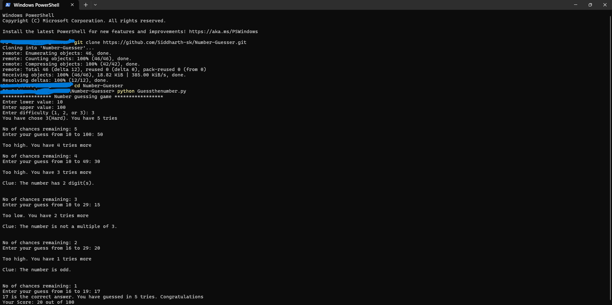

# Number Guessing Game (Python)

A beginner-friendly console game in Python where the player guesses a secret number.  
Includes difficulty levels, scoring, and helpful clues to keep the game interesting.

---

## Features
- Custom number range selection  
- Three difficulty modes:
  - Easy → 10 tries  
  - Medium → 7 tries  
  - Hard → 5 tries  
- Scoring system (start with 100 points, lose points for incorrect guesses)  
- Helpful clues such as:
  - Even or odd  
  - Multiple of 3 or 5  
  - Number of digits  
  - First and last digit  

---

## How to Play
1. Clone the repository:
   ```bash
   git clone https://github.com/Siddharth-sk/Number-Guesser.git

2. Gameplay example
   


   

